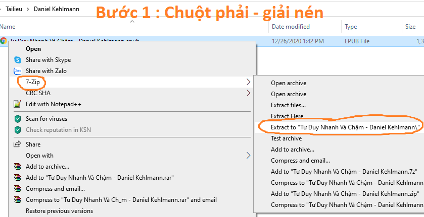
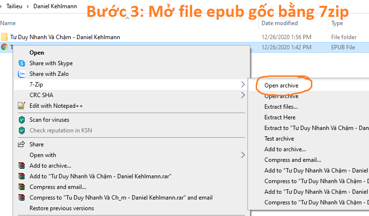
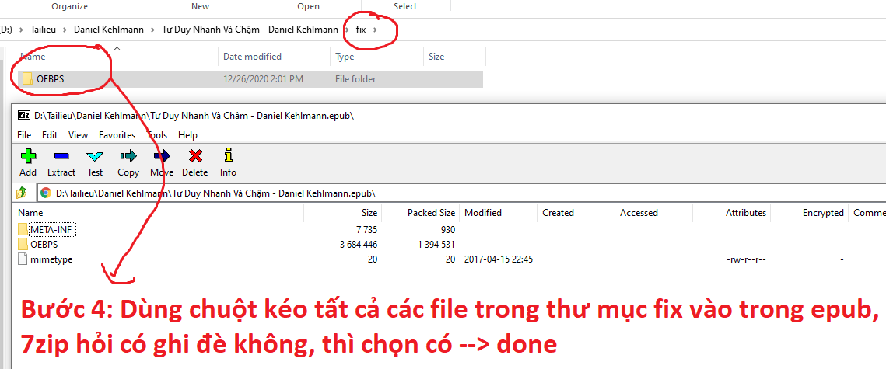

## Công cụ chuẩn hóa nội dung epub

Chuẩn bị
------------
Cài đặt 7z để hỗ trợ giải nén file epub : https://www.7-zip.org/7z.html

Cộng cụ VietnameseTextNormalizer-XHTML bản đã build sẵn cho windows :
https://github.com/langmaninternet/VietnameseTextNormalizer/blob/master/CongCuChuanHoaEpubChoKindle/VietnameseTextNormalizer-XHTML.zip

Tiến hành
------------

